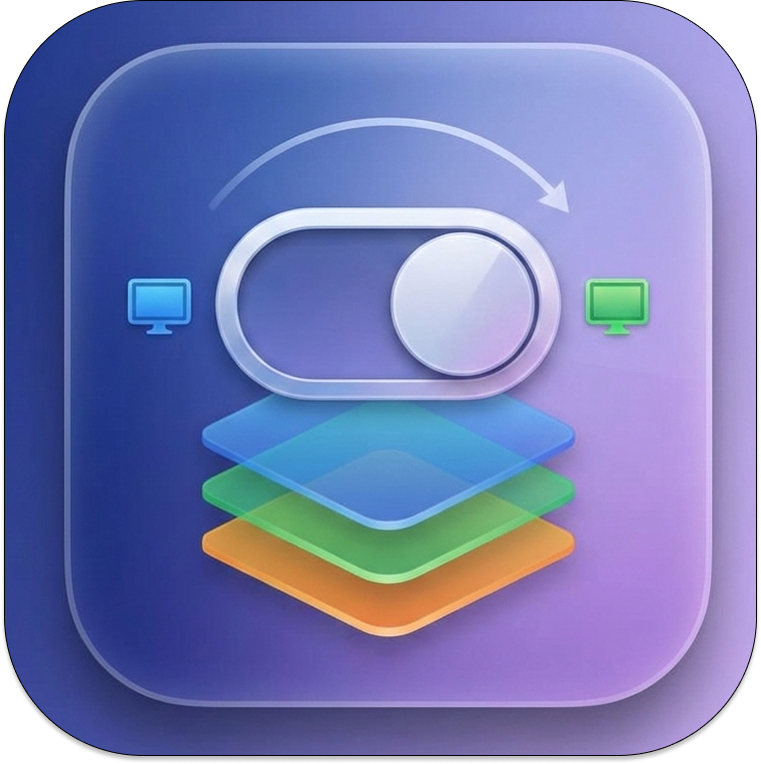

<p align="center">
  
</p>

<h1 align="center">ContextSwitcher</h1>

<p align="center">
  <a href="README.md">English</a> | <a href="README.ko.md">한국어</a>
</p>

<p align="center">앱 윈도우를 숨기거나 표시하여 여러 개발 컨텍스트를 관리하는 macOS 메뉴바 유틸리티입니다.</p>

## 데모

https://github.com/user-attachments/assets/010d90dd-5c32-4f04-9d9f-1386d15954ed

## 주요 기능

- 현재 윈도우 배치를 이름이 있는 워크스페이스로 저장
- 메뉴바에서 워크스페이스 간 즉시 전환
- 개별 윈도우를 선택적으로 표시/숨김 (예: 특정 IntelliJ 프로젝트만)
- 빠른 접근을 위한 플로팅 HUD 패널
- 한 번의 클릭으로 숨긴 모든 앱 복원

## 다운로드

| 플랫폼 | 다운로드 |
|--------|----------|
| macOS 14+ (Apple Silicon) | [ContextSwitcher-1.1.0-arm64.dmg](https://github.com/minsang-alt/contextSwitcher/releases/latest/download/ContextSwitcher-1.1.0-arm64.dmg) |

> DMG를 열고 `ContextSwitcher.app`을 `/Applications`로 드래그하세요.
>
> **macOS Gatekeeper 경고 시:** 서명되지 않은 앱이라 경고가 뜰 수 있습니다. 아래 중 하나를 실행하세요.
> - Finder에서 `ContextSwitcher.app`을 **우클릭 → 열기**
> - 또는 터미널에서: `xattr -cr /Applications/ContextSwitcher.app`

## 소스에서 빌드

```bash
git clone https://github.com/minsang-alt/contextSwitcher.git
cd ContextSwitcher
./scripts/install.sh
```

## 설정

실행 후 접근성 권한을 부여하세요:

1. **시스템 설정 → 개인정보 보호 및 보안 → 손쉬운 사용** 열기
2. **ContextSwitcher**를 추가하고 토글 ON

> 참고: 접근성 권한은 다시 빌드할 때마다 초기화됩니다. OFF 후 다시 ON 하세요.

## 사용법

1. 윈도우를 배치한 후 메뉴바 아이콘 → **+** 클릭하여 워크스페이스 캡처
2. 이름을 지정하고 포함할 앱/윈도우 선택
3. 워크스페이스 이름을 클릭하여 컨텍스트 전환
4. **Show All Apps**를 클릭하여 모든 앱 복원

## 라이선스

GPL-3.0. 자세한 내용은 [LICENSE](LICENSE)를 참조하세요.