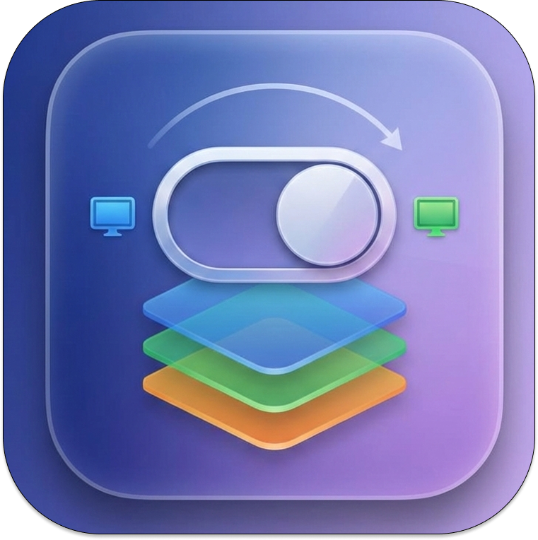

<p align="center">
  
</p>

<h1 align="center">ContextSwitcher</h1>

<p align="center">
  <a href="https://github.com/minsang-alt/contextSwitcher/actions/workflows/build.yml"></a>
  <a href="https://github.com/minsang-alt/contextSwitcher/releases/latest"></a>
  <a href="LICENSE"></a>
  
  
</p>

<p align="center">
  <a href="README.md">English</a> | <a href="README.ko.md">한국어</a>
</p>

<p align="center">
  A lightweight macOS menu bar utility that lets you save, switch, and restore window layouts as named workspaces — designed for developers juggling multiple projects.
</p>

---

## Demo

https://github.com/user-attachments/assets/010d90dd-5c32-4f04-9d9f-1386d15954ed

## Features

- **Workspace Management** — Save current window layouts as named workspaces
- **Instant Switching** — Switch between workspaces from the menu bar
- **Global Shortcuts** — Keyboard shortcuts to switch workspaces from any app
- **Window-Level Control** — Selectively show/hide individual windows (e.g., specific IntelliJ projects or Chrome profiles)
- **Floating HUD** — Quick-access panel for workspace switching
- **Restore All** — Bring back all hidden apps with one click

## Design Philosophy

ContextSwitcher follows a clear set of principles:

- **Performance** — Instant switching with no animation delays
- **Simplicity** — Does one thing well: context switching
- **Non-Disruptive** — Works with your existing workflow, not against it
- **Invisible** — Lives in the menu bar, stays out of your way

### How It Works

ContextSwitcher uses macOS Accessibility APIs to **hide and show application windows**. When you switch to a workspace, apps not belonging to that workspace are hidden, and the workspace's apps are brought forward. This is fundamentally different from virtual desktop approaches — your windows stay on the same Space.

### Why Not Tiling?

ContextSwitcher intentionally does **not** manage window positions or tiling. There are excellent dedicated tools for that (Rectangle, Magnet, yabai). ContextSwitcher focuses purely on **which apps are visible**, letting you compose it with any window manager you prefer.

## Installation

### Download Binary

| Platform | Download |
|----------|----------|
| macOS 14+ (Apple Silicon) | [ContextSwitcher-1.2.0-arm64.dmg](https://github.com/minsang-alt/contextSwitcher/releases/latest/download/ContextSwitcher-1.2.0-arm64.dmg) |

> After downloading, open the DMG and drag `ContextSwitcher.app` to `/Applications`.
>
> **macOS Gatekeeper warning:** Since the app is not yet notarized, macOS may show a warning:
> - Right-click `ContextSwitcher.app` in Finder → **Open**
> - Or run: `xattr -cr /Applications/ContextSwitcher.app`

### Homebrew (coming soon)

```bash
brew install --cask minsang-alt/tap/contextswitcher
```

### Build from Source

```bash
git clone https://github.com/minsang-alt/contextSwitcher.git
cd ContextSwitcher
./scripts/install.sh
```

**Requirements:** Xcode 15+ or Swift 6.0 toolchain

## Setup

After launching, grant Accessibility permission:

1. Open **System Settings → Privacy & Security → Accessibility**
2. Add **ContextSwitcher** and toggle it ON

> **Note:** Accessibility permission resets after each rebuild. Toggle it OFF then ON again.

## Usage

1. **Arrange your windows** for a project
2. Click the menu bar icon → **"+"** to capture a workspace
3. **Name it** and select which apps/windows to include
4. Click a **workspace name** to switch contexts
5. Click **"Show All Apps"** to restore everything

### Keyboard Shortcuts

Assign global shortcuts to workspaces for instant switching:

1. Open menu bar → workspace settings
2. Click the shortcut field and press your desired key combination
3. Use the shortcut from any app to switch instantly

### Tips

- **JetBrains IDEs**: ContextSwitcher recognizes individual project windows, so you can include only specific IntelliJ/WebStorm projects in a workspace
- **Browsers**: Chrome, Brave, and Edge profiles are detected separately
- **Composability**: Use ContextSwitcher alongside Rectangle/Magnet for full window management

## Architecture

```
ContextSwitcher/
├── Models/          # Data models (KeyShortcut, WindowIdentifier, WorkspaceConfiguration)
├── Services/        # Core logic (Accessibility, Shortcuts, WorkspaceSwitch, Store)
├── Views/           # SwiftUI views (MenuBar, WorkspaceList, Capture, HUD, ShortcutRecorder)
├── Panel/           # AppKit floating panel (HUD, Capture controllers)
├── Utilities/       # Helpers (IntelliJ title parser)
└── Resources/       # Info.plist, AppIcon
```

## Contributing

See [CONTRIBUTING.md](CONTRIBUTING.md) for guidelines.

**Quick start:**

```bash
# Install dev dependencies
brew bundle

# Build and install
./scripts/install.sh

# Lint
swiftlint lint
swiftformat --lint .
```

PR titles must follow [Conventional Commits](https://www.conventionalcommits.org/): `feat:`, `fix:`, `docs:`, `chore:`, `refactor:`, `ci:`

## License

GPL-3.0. See [LICENSE](LICENSE) for details.
